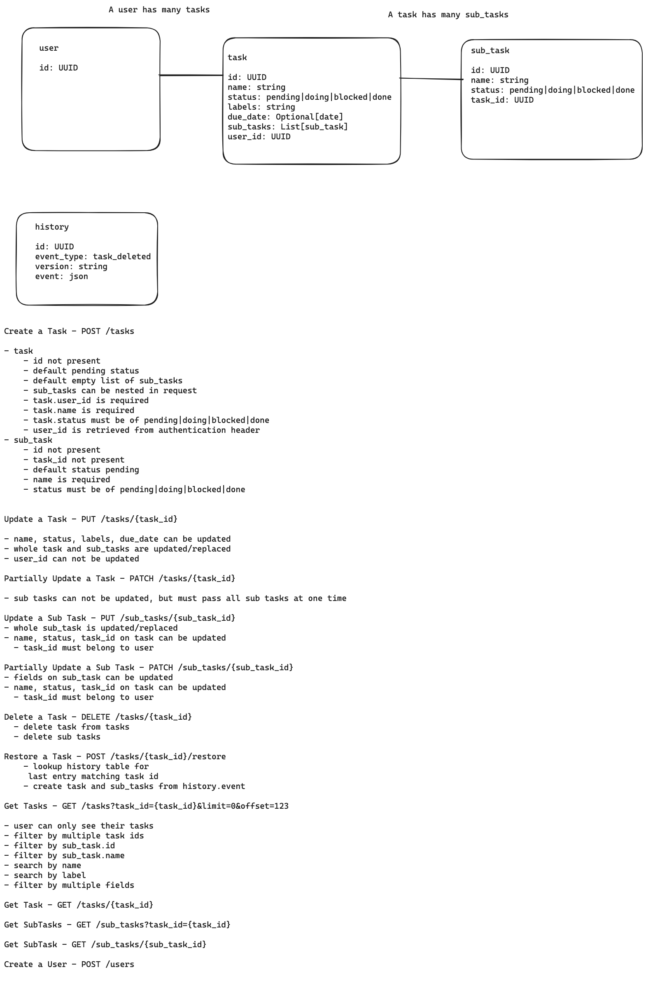

# TaskRestApi
REST API for managing tasks using poetry, FastAPI and dependency-injector

## Requirements

REST API which will manage tasks, each task is assigned to a user. Each user is only able
to see their own tasks.
A task can only have one status at a time, which could be one of the following:
- Pending
- Doing
- Blocked
- Done

If a task were to be deleted, it must be moved into a history table for record purposes.
The following requirements must be met:
- Python 3.9 and 3.10 support
- Correctly apply code formatting, preferably using the Black format
- Apply type annotations
- Use of a light weight framework
- Tasks must be stored in a database
- Database must be managed by code using migrations

Bonus items:
• Sub task support
• Restoring of deleted tasks
• Setting due dates for tasks
• Adding labels for tasks
• Documentation illustrating the design and thought process for the implemented solution

##TODO

- pre-commit
  - black code formatting
  - linting
- project setup
  - ~~fastapi~~
  - directory structure
    - tests
    - routes
    - dependency injector
- spec out task api endpoints
  - endpoints
  - resources
  - request structure
  - response structure
  - edge cases
- model design
- migrations
