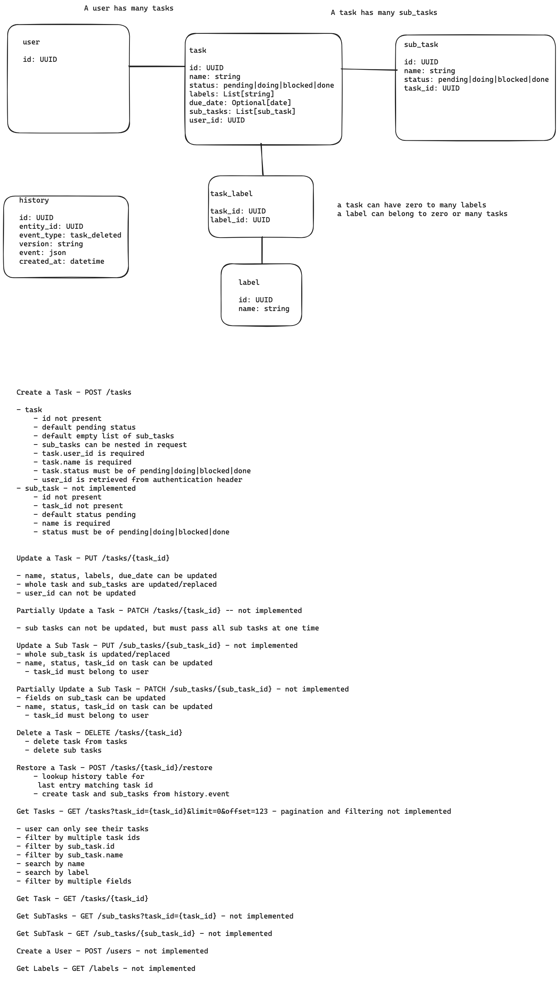

# TaskRestApi
REST API for managing tasks using poetry, FastAPI and dependency-injector

## Requirements

REST API which will manage tasks, each task is assigned to a user. Each user is only able
to see their own tasks.
A task can only have one status at a time, which could be one of the following:
- Pending
- Doing
- Blocked
- Done


If a task were to be deleted, it must be moved into a history table for record purposes.
The following requirements must be met:
- ~~Python 3.9 and 3.10 support~~
- ~~Correctly apply code formatting, preferably using the Black format~~
- ~~Apply type annotations~~
- ~~Use of a light weight framework~~
- ~~Tasks must be stored in a database~~
- ~~Database must be managed by code using migrations~~


Bonus items:
- Sub task support
- ~~Restoring of deleted tasks~~
- ~~Setting due dates for tasks~~
- ~~Adding labels for tasks~~
- Documentation illustrating the design and thought process for the implemented solution

# Notes



This was my initial Task API Spec. I drew up a rough model for the different resources, schemas and how they would link together. I sketched out the various endpoints that should be implemented.
The endpoint spec didn't change too much, mostly just adding endpoints that I thought would be useful if I had time.

There were 2 things I wanted to show off in this tech exercise.
1. Speed to mock up and implement the endpoints, which I discussed with Adam and Richard during my first interview. I wanted to try and show how you can create short feedback loops, without having to get bogged down in database setup and integration.
2. Using dependency injection and inversion of control, to easily swap between implementations of a TaskManager. It took a while to setup, as I hadn't done this from scratch before on my own. Once it was set up it made a big difference in development speed, and switching to using the sqlite database.  

If you look through the commits, you will see I didn't start working on the SqliteTaskManager until Sunday morning. I was working on the InMemoryTaskManager up until then. I enjoyed the separations of concerns between the api, domain and database. I thought having one set of tests that you could run against InMemoryTaskManager and SqliteTaskManager was really powerful.
The in_memory tests take ~70ms whereas the sqlite ones take ~700ms. Not a massive difference, but as the test suite grows, and you integrate with more services, it will pay dividends. Especially for having a good feedback loop when developing.

If you want to learn more about the dependency-injector library see their website: https://python-dependency-injector.ets-labs.org/.

The technologies I am using are FastAPI, pydantic, dependency-injector, SQLAlchemy 2.0, alembic and pytest with black, and ruff for formatting. I manually run mypy for linting, but it is not enforced.

If you have any questions, thoughts, or want to discuss the task further, please do reach via email, or phone me.

## Setup

```shell
git clone git@github.com:tstuttard/TaskRestApi.git
cd TaskRestApi
# Make sure you have python 3.9 or 3.10 installed
poetry shell
poetry install

# create database and run migrations (uses a sqlite database by default)
alembic upgrade head

# run the app, again uses a sqlite database by default
python -m uvicorn app.main:app

# if you want to use the in memory database run the following instead
export TASK_MANAGER_TYPE=in_memory;python -m uvicorn app.main:app 
```

This should setup up the project and spin up the FastAPI application.
The sqlite database is stored at `./app/task.db`

Browse to `127.0.0.1:8000/docs` to play about with the API. Note that you have to pass `user_id` as a query parameter with any request, and it must be a valid UUID. 

For example `POST 127.0.0.1/tasks?user_id=50fd38cc-6dc3-4202-b3aa-0eeee458184a` 

See Trade-Offs & Assumptions below, for why. 

To run the tests:

```shell
# run pytest using sqlite database
export TASK_MANAGER_TYPE=sqlite;pytest

# run pytest using in_memory database
export TASK_MANAGER_TYPE=in_memory;pytest 
```

## Trade-Offs & Assumptions

I am not going to implement proper authentication. I will assume that user management and authentication is handled by a middleware or api gateway or authentication service, and will use a query parameter to set the user_id.
I will also assume no user knows another users user_id.
I have chosen a query parameter so that swagger ui is easy to use. You can't edit request headers easily without editing the request headers manually via the web console or browser extension. 
I don't want to spend time configuring authentication properly using one of many authentication mechanisms.

I didn't get round to implementing sub-tasks. It should be like how labels will be implemented.

I think labels would consider using an in memory datastore like redis/memcached for labelling, with a mechanism to back up labels. The implementation for the InMemoryTaskManager was really simple. 
I do wonder how that might change if I added filtering.

I didn't get round to adding filtering or pagination. I wanted to show off dependency injection, inversion of control and how simple it makes prototyping and testing.
This is a nice resource of different types of pagination: https://nordicapis.com/understanding-5-types-of-web-api-pagination/.
I would have gone with limit/offset for simplicity.


I wish I started throwing domain errors like I did for TaskAlreadyExists. Returning None in the TaskManager is the main cause of the mypy errors. Even having a TaskNotFound error, and adding an error handler for that would clean up the code a lot. This should be trivial to add, but I wanted to spend the last hour writing up my thoughts here.

If I had time, and if I had implemented sub tasks, there would have been a bit of tradeoff for not implementing partial update (PATCH). If you have a large amount of sub-tasks, a PUT request replacing all sub-tasks could be large. If a task had over 100 sub tasks, it probably would make more sense to retreive/update/delete sub-tasks via another resource endpoint: /sub_tasks.

If I had more time, I would like to have utilised pytest fixtures more, and pytest parameterize. There were some tests that made the same assertions on methods, and changing the input/output with parameterized would have been cleaner.

Lastly I would want to cleanup the directory and file structure, and add docstrings explaining a bit more what each file, class and function does. I think it could have been better laid out separating API layer, from the Domain layer, from the Database layer.


## Retrospective

### Could I have used sqlite inmemory database instead of writing my own custom inmemory database using dictionaries and keys? 

It would have made filtering and pagination easier to implement in memory. 
It would have forced me to think about the database structure earlier, which I would prefer to delay until the whole api is fleshed out.
Databases require configuration and setup, and I would prefer to delay making decisions about that until later.

### How come you didn't split the domain layer from the database layer?

I think now would be a good time to think about that. Introducing a repository classes might clean up the task_managers.py file a lot. 

### How come I have used pydantic's BaseModel.model_dump() everywhere? 

This exercise has shown gaps in my knowledge of how to use pydantic efficiently. Something I will work on in the future.

### How come I didn't set up linting/mypy from the start?

I wanted to get started and implement the api endpoints first. I haven't setup linting in a while and did not want to spend long at the start setting up and debugging it.

## Resources
[CLI Application Tutorial using dependency-injector](https://github.com/ets-labs/python-dependency-injector/blob/cc2304e46e054ae08dc12995428759fbfb51af10/docs/tutorials/cli.rst)


